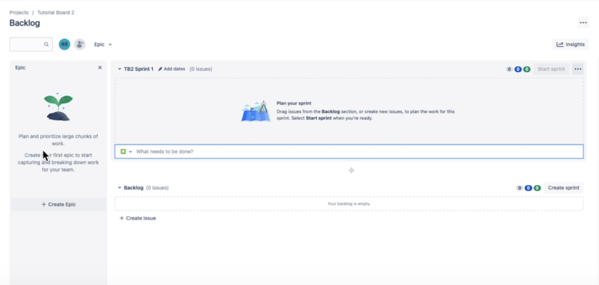

# How to use sprints in Jira

A sprint is a fixed time period in the software development life cycle where teams complete designated work from a product backlog of tickets. This guide covers instructions on how to create, populate, and start a sprint in Jira. 

For the purposes of this guide, we assume prerequisite knowledge of the following concepts:

- The basics of Agile methodology for software development
- [Issue types](/support-articles/issue-types) in Jira 
- [Managing project permissions](/support-articles/project-permissions)

## 1. Set up and create a project

You'll get started by creating a project in Jira. In the horizontal navigation bar, select `Projects` and select `Create project`. Before the project is set up, you will be prompted to configure a few settings (described below).

### Select a project template

You will see a variety of project templates which you can choose from. You should already be on the `Software development` project template page. Select the `Scrum` option, which allows you to map projects according to a roadmap and set up sprints. 

### Choose a project type

You'll select either the **team-managed** or **company-managed** project type. What you choose will depend on the nature of the work your team is doing and whether or not your company's Jira administrator needs to be responsible for setting up and maintaining the project. Read our [guide on project types](/support-articles/project-types) for more context on team vs. company-managed project types. 

### Add project details

After choosing your project type, add a name for your project and set the project's access level (private, limited, or open). 

*Note that the name you input automatically generates a **Key** , which is an abbreviation for referring to your project. However, you can edit the Key if you'd like it to be different than the autogenerated abbreviation.*

### Create the project 

Once you've completed configuring all the required project settings, you can click `Create project`. You'll then be taken to your new project board page. 

## 2. Populate the backlog 

The next step is to populate the backlog with issues related to the software your team is developing. Depending on your team's context, you can start by creating an Epic *or* you can create issues and then later add them to an Epic. 

### Create an epic

Using the left panel on the backlog board as shown below, you can create an epic capturing larger chunks of work. Click `+ Create Epic` and give your Epic a title. 

You can configure details including:
- Start date
- Due date
- Issues that are should be a part of the Epic

### Create issues in the backlog 

To create an issue, click `+ Create issue`. You can then add the title of the issue and configure specific information about the issue, including:

- Description
- Assignee
- Start date
- Due date
- Story point estimate

> **For the purposes of creating a sprint, it is important to include the story point estimate. Note that 1 story point corresponds with 1 day's work, which will then determine how many story points can be captured in a given sprint.**

### Link issues to the Epic

Link issues to an Epic by clicking `Link issue` or the link icon. You can then select the Epic you'd like to link it to. 

If you already have an Epic selected when you're creating issues, you won't need to take this extra step, since the issues will have been automatically linked to the Epic you had selected.

## 3. Start and complete a sprint

Once you've set up your project and populated your backlog, you're ready to create and start a sprint.

### Create the sprint 
Go to the Backlog and select the `Create sprint` in the upper right hand corner of the Backlog list.

You can configure the duration of the sprint and populate a start and end date. Optionally, you can write a sprint goal to help keep your work focused. 

*You may return to update the sprint information as needed later, though we do not recommend editing the information after the sprint has started.*

### Add issues to your sprint

You can drag issues from the Backlog to the into the sprint box to determine what your team will be focusing on for that sprint. You can also click `+ Create issue` to create issues directly within the sprint. 

### Start the sprint

Once you've configured the sprint details and added the issues you want to be a part of the sprint, you can click `Start sprint` in the upper right hand corner of the sprint box. 
 
### Complete the sprint

In the left hand navigation bar under `PLANNING`, you'll see a `Board` option for viewing your sprint. 

Here, you can drag issues from `TO DO` to `IN PROGRESS` to `DONE` as your team makes progress in completing various issues. When the duration of the sprint is up, you can click `Complete sprint` in the upper right hand corner of the sprint board view. 

After you click `Complete sprint`, a dialog box will summarize how many issues you've completed and how many remain open. 

Use the drop down to select whether to move open issues to a new sprint, or the backlog. 

If you send the remaining open issues to the backlog and decide you want to create a sprint, you can always click `Create sprint` in the upper right hand corner of the backlog. 

> **Note that you can create several sprints to plan future work, but you can only have one sprint actively running at a time.** 

